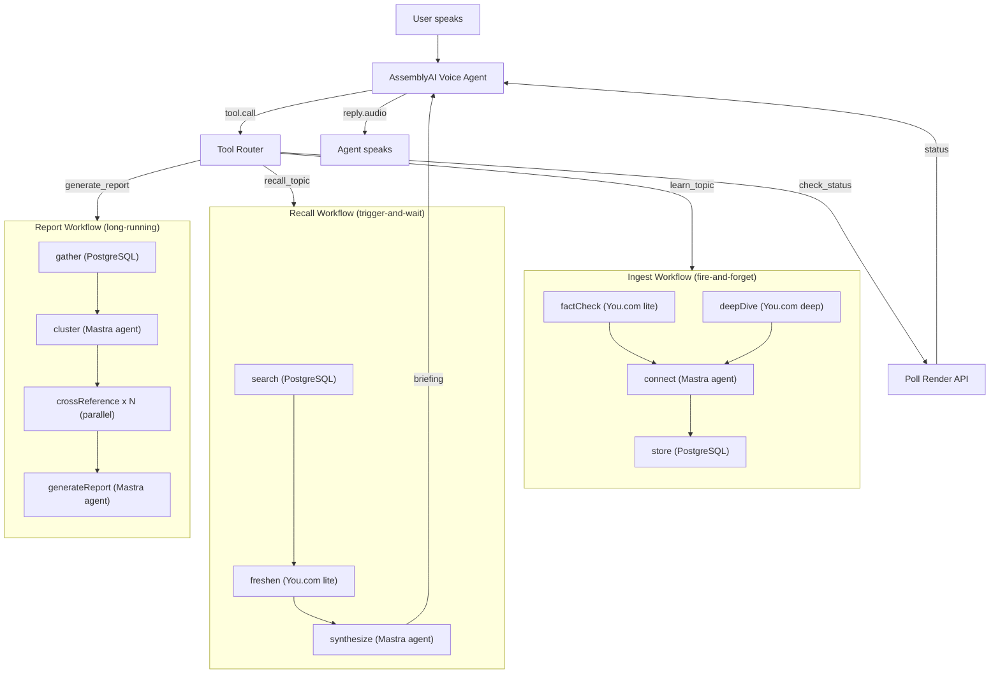

# Ravendr

[](https://render.com/deploy?repo=https://github.com/ojusave/ravendr)

A voice-first personal knowledge base. You talk to it, and it accumulates what you know over time.

The interesting part is how voice maps to durable tasks. When you mention a topic, the voice agent ([AssemblyAI](https://www.assemblyai.com)) fires off an ingest workflow in the background: a fact-check against the live web via [You.com](https://you.com), a deep research pass, then synthesis and storage in PostgreSQL. You keep talking. Later, when you ask "what do I know about quantum computing?", a recall workflow searches your knowledge base, checks whether anything has gone stale, and reads back a spoken briefing. Each of these runs as a [Render Workflow](https://render.com/workflows) with its own task tree, retries, and timeouts visible in the Dashboard. The AI agents that handle synthesis and cross-referencing are built with [Mastra](https://mastra.ai) and Anthropic's Claude.

## Table of Contents

- [How It Works](#how-it-works)
- [Deploy](#deploy)
- [Environment Variables](#environment-variables)
- [Project Structure](#project-structure)
- [API](#api)
- [Troubleshooting](#troubleshooting)

## How It Works



The voice proxy in `src/voice/proxy.ts` handles AssemblyAI's `tool.call` events by routing them to Render Workflows via the `@renderinc/sdk`:

```typescript
// Ingest: fire-and-forget (background research while you keep talking)
const started = await render.workflows.startTask(`${WORKFLOW_SLUG}/ingest`, [topic, claim]);

// Recall: trigger-and-wait (blocks until the briefing is ready)
const started = await render.workflows.startTask(`${WORKFLOW_SLUG}/recall`, [query]);
const finished = await started.get();
```

The three workflows have different shapes. Ingest is fire-and-forget: the fact-check and deep-dive tasks run in parallel, merge into a synthesized entry, and store it. You keep talking while this happens. Recall blocks: it needs to search, check freshness, and build a briefing before the agent can speak. Report is the expensive one: it clusters all your knowledge by topic, then spins up a `crossReference` task for each cluster in parallel before generating the final document.

The Render Dashboard shows the full task tree with inputs, outputs, duration, and retry history:

```
ingest                                         starter  300s
├── factCheck "quantum computing"              starter   30s   ✓ 4.2s
├── deepDive "quantum computing"               standard 120s   ✓ 28s
├── connect                                    starter   60s   ✓ 8.1s
└── store                                      starter   30s   ✓ 0.3s
```

## Deploy

Ravendr runs as two Render services: a **web service** and a **workflow service**.

### Prerequisites

You need API keys from four providers:

- [AssemblyAI](https://www.assemblyai.com/app): voice agent (web service)
- [Render](https://render.com/docs/api#1-create-an-api-key): workflow triggers (web service)
- [Anthropic](https://console.anthropic.com/): Claude for AI agents (workflow service)
- [You.com](https://you.com): web research (workflow service)

Don't have a Render account? [Sign up here](https://render.com/register?utm_source=github&utm_medium=referral&utm_campaign=ojus_demos&utm_content=readme_link).

### Step 1: Deploy the web service via Blueprint

Click **Deploy to Render** at the top of this page. The Blueprint creates the web service and a PostgreSQL database. You'll set `ASSEMBLYAI_API_KEY` and `RENDER_API_KEY` during setup.

### Step 2: Create the workflow service manually

Render Workflows are not yet supported in Blueprint files.

1. In the [Render Dashboard](https://dashboard.render.com), click **New** > **Workflow**
2. Connect the same GitHub repo
3. **Build Command**: `npm install && npm run build`
4. **Start Command**: `node dist/workflows/index.js`
5. Add environment variables:
   - `ANTHROPIC_API_KEY` (required)
   - `YOU_API_KEY` (required)
   - `DATABASE_URL`: copy from the `ravendr-db` database's connection info
   - `NODE_VERSION`: `22`
   - `ANTHROPIC_MODEL` (optional, defaults to `claude-sonnet-4-20250514`)
6. Name the service `ravendr-workflows` (this must match the web service's `WORKFLOW_SLUG`)
7. Click **Create Workflow**

## Environment Variables

### Web service (`ravendr-web`)

| Variable | Required | Default | Description |
|---|---|---|---|
| `ASSEMBLYAI_API_KEY` | Yes | | AssemblyAI API key for voice agent |
| `RENDER_API_KEY` | Yes | | Render API key for triggering workflows |
| `DATABASE_URL` | Yes | | PostgreSQL connection string (auto-set by Blueprint) |
| `WORKFLOW_SLUG` | No | `ravendr-workflows` | Slug of the workflow service |
| `PORT` | No | `3000` | Server port |

### Workflow service (`ravendr-workflows`)

| Variable | Required | Default | Description |
|---|---|---|---|
| `ANTHROPIC_API_KEY` | Yes | | Anthropic API key for Claude |
| `YOU_API_KEY` | Yes | | You.com API key for web research |
| `DATABASE_URL` | Yes | | PostgreSQL connection string |
| `ANTHROPIC_MODEL` | No | `claude-sonnet-4-20250514` | Claude model ID |
| `NODE_VERSION` | No | `22` | Node.js version |

## Project Structure

```
src/
├── server.ts              # Hono web server (HTTP + WebSocket)
├── voice/
│   ├── config.ts          # AssemblyAI session config and tool definitions
│   └── proxy.ts           # WebSocket proxy: browser ↔ AssemblyAI ↔ Render Workflows
├── agents/
│   ├── index.ts           # Supervisor agent + sub-agent composition
│   ├── fact-checker.ts    # Scores claim confidence against evidence
│   ├── synthesizer.ts     # Voice-friendly summaries
│   └── connector.ts       # Cross-topic relationship detection
├── tools/
│   ├── learn.ts           # learn_topic → Ingest workflow
│   ├── recall.ts          # recall_topic → Recall workflow
│   ├── report.ts          # generate_report → Report workflow
│   └── status.ts          # check_status → poll Render API
├── workflows/
│   ├── index.ts           # Workflow entry point (registers all tasks)
│   ├── ingest.ts          # factCheck + deepDive → connect → store
│   ├── recall.ts          # search → freshen → synthesize
│   └── report.ts          # gather → cluster → crossReference (parallel) → generateReport
├── lib/
│   ├── db.ts              # PostgreSQL schema + queries (knowledge_entries, workflow_runs)
│   ├── you-client.ts      # You.com Research API wrapper (lite/deep/exhaustive)
│   ├── llm.ts             # Anthropic Claude helpers
│   └── render-utils.ts    # Render signup URLs and branding
└── static/
    └── index.html         # Voice UI and workflow activity panel
```

Two database tables: `knowledge_entries` stores topics with sources, confidence scores, and cross-references. `workflow_runs` tracks task status for the activity panel.

## API

### `WebSocket /ws/voice`

Proxies audio between the browser and AssemblyAI's Voice Agent API. The server intercepts `tool.call` events, routes them to Render Workflows, and sends back `tool.result` events.

Client sends PCM16 audio:
```json
{ "type": "input.audio", "audio": "<base64 PCM16>" }
```

Server forwards from AssemblyAI:
```json
{ "type": "session.ready", "session_id": "..." }
{ "type": "transcript.user", "text": "Tell me about quantum computing" }
{ "type": "transcript.agent", "text": "Got it, researching..." }
{ "type": "reply.audio", "data": "<base64 PCM16>" }
{ "type": "reply.done" }
```

### `GET /api/workflows/recent`

Returns the 10 most recent workflow runs (for the activity panel).

### `GET /api/knowledge`

Returns all knowledge entries in the database.

### `GET /api/report/:taskRunId`

Returns the result of a completed report workflow task.

### `GET /health`

Returns `{ "status": "ok", "service": "ravendr-web" }`.

## Troubleshooting

**Voice connection fails immediately**: check that `ASSEMBLYAI_API_KEY` is set on the web service. The server logs `ASSEMBLYAI_API_KEY not configured` if missing.

**Workflows never complete**: verify the workflow service is running and its name matches `WORKFLOW_SLUG` (default: `ravendr-workflows`). The web service discovers the workflow service by slug.

**"recall" returns empty**: the ingest workflow runs in the background. If you ask to recall a topic immediately after mentioning it, the research may still be running. Use `check_status` or wait for the ingest tasks to complete in the Dashboard.

**Database connection errors**: the web service expects `DATABASE_URL` to be set automatically by the Blueprint. The workflow service needs it copied manually from the `ravendr-db` database settings. Both services use SSL in production.
