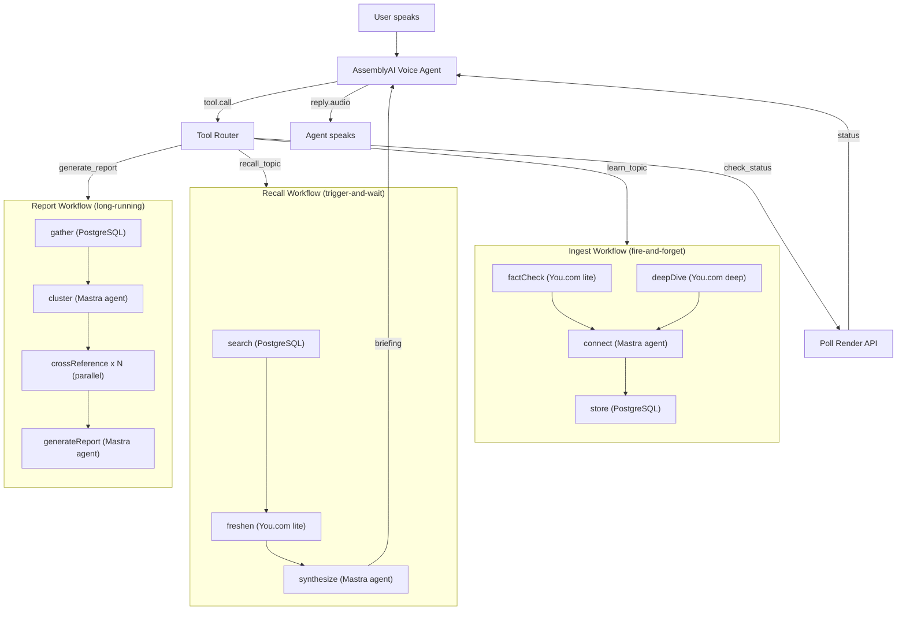
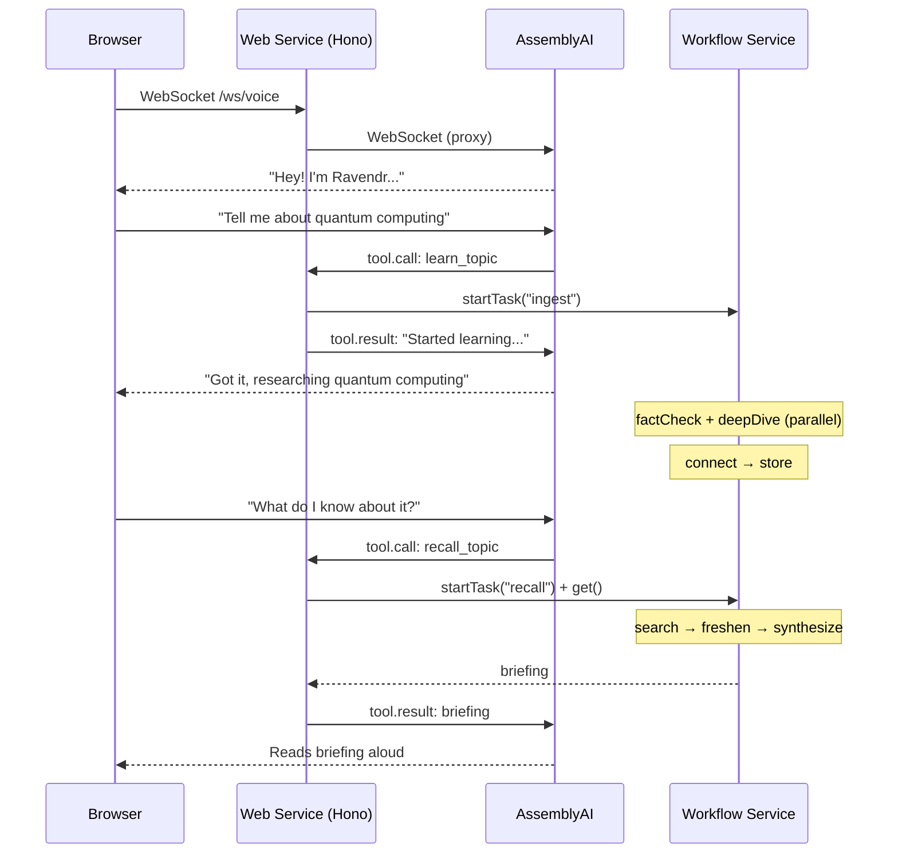

# Ravendr

[](https://render.com/deploy?repo=https://github.com/ojusave/ravendr)

A voice-first knowledge base builder where four tools each do what they're best at:

- **[AssemblyAI](https://www.assemblyai.com)** runs a real-time voice agent: speech-to-speech over a single WebSocket with tool calling, barge-in, and natural turn detection. No separate STT/TTS pipeline.
- **[Render Workflows](https://render.com/workflows)** provides durable orchestration: three distinct workflow types (ingest, recall, report) with parallel execution, per-task retries, and full observability in the Dashboard.
- **[You.com](https://you.com)** provides tiered web research as workflow tasks: `lite` for fast fact-checks (~5s), `deep` for thorough topic expansion (~30s), with inline citations.
- **[Mastra](https://mastra.ai)** provides TypeScript-native AI agents: a supervisor pattern with specialist sub-agents for fact-checking, synthesis, and cross-referencing.

Talk about any topic. Ravendr fact-checks it, deep-researches it, and stores it. Ask what you know, and it recalls with freshness checks. Request a report, and it clusters and cross-references everything you've learned.

---

## Why Four Layers

Each tool solves a problem the others can't.

### Why AssemblyAI (not a text form)

A knowledge base you build over time needs an interaction model that's ongoing, not one-shot. With a voice agent:

- You discuss topics naturally while workflows run in the background
- You can interrupt ("actually, what about X?") via barge-in
- The agent calls tools mid-conversation: `learn_topic`, `recall_topic`, `generate_report`, `check_status`
- You don't wait staring at a spinner: you keep talking while research happens

A text form gives you "submit → wait → result." Voice gives you a continuous conversation where knowledge accumulates.

### Why Render Workflows (not one pipeline)

Unlike a single research pipeline, Ravendr has three workflow types with different execution patterns:

- **Ingest** needs parallel tasks (fact-check + deep-dive run simultaneously) with fire-and-forget: you don't wait for research to finish.
- **Recall** needs sequential tasks (search → freshness check → synthesis) with trigger-and-wait: you need the answer before the agent speaks.
- **Report** needs dynamic parallelism (cross-reference each topic cluster in parallel) with long-running compute.

Each task has its own retry config, timeout, and compute plan. A single function can't express these patterns.

### Why You.com (not a single search tier)

Different workflow stages need different research depths. Fact-checking a claim needs a quick lookup (~5s). Expanding a topic into a knowledge entry needs deep multi-hop research (~30s). Checking if stored knowledge is still current needs a fast freshness check. You.com's `research_effort` parameter (`lite` / `standard` / `deep` / `exhaustive`) lets each task pick the right depth.

### Why Mastra (not raw LLM calls)

The agents need structure: a supervisor that routes voice tool calls to workflows, a fact-checker that scores confidence, a synthesizer that generates voice-friendly summaries, a connector that finds cross-topic relationships. Mastra provides typed tools with Zod schemas, a supervisor pattern with sub-agents, and the framework to keep agents testable.

---

## How It Works



The voice proxy handles AssemblyAI's `tool.call` events by routing them to Render Workflows:

```typescript
// Ingest: fire-and-forget (startTask)
const started = await render.workflows.startTask(`${WORKFLOW_SLUG}/ingest`, [topic, claim]);
// returns immediately, research runs in background

// Recall: trigger-and-wait (startTask + get)
const started = await render.workflows.startTask(`${WORKFLOW_SLUG}/recall`, [query]);
const finished = await started.get(); // waits for result
// agent reads back the briefing
```

---

## What Each Tool Does

| Step | Tool | What happens | Config |
|---|---|---|---|
| **factCheck** | You.com (lite) | Quick fact-check of user's claim against live web | starter, 30s, 2 retries |
| **deepDive** | You.com (deep) | Thorough topic expansion with cited sources | standard, 120s, 2 retries |
| **connect** | Mastra agent | Cross-reference new findings with existing knowledge | starter, 60s, 1 retry |
| **store** | PostgreSQL | Persist knowledge entry with sources and connections | starter, 30s, 2 retries |
| **search** | PostgreSQL | Query knowledge base for matching entries | starter, 30s, 1 retry |
| **freshen** | You.com (lite) | Check if stored knowledge is still current | starter, 60s, 2 retries |
| **synthesize** | Mastra agent | Generate voice-friendly briefing from recalled knowledge | starter, 60s, 1 retry |
| **cluster** | Mastra agent | Group all knowledge entries into topic clusters | standard, 60s, 2 retries |
| **crossReference** | Mastra agent | Find connections across cluster (parallel, per cluster) | starter, 60s, 1 retry |
| **generateReport** | Mastra agent | Comprehensive synthesis report with gaps analysis | standard, 120s, 1 retry |

---

## Architecture



Two Render services:

- **Web service** (`ravendr-web`): Hono server with WebSocket proxy. Serves the UI, proxies audio between the browser and AssemblyAI, handles tool calls by triggering workflows. Does no research work.
- **Workflow service** (`ravendr-workflows`): ten tasks across three workflow types. Each task run gets its own compute instance with independent retries and timeouts.

---

## Dashboard Task Tree

When a user discusses a topic, the Render Dashboard shows:

```
ingest (orchestrator)                           starter  300s
├── factCheck "quantum computing"               starter   30s   ✓ 4.2s
├── deepDive "quantum computing"                standard 120s   ✓ 28s
├── connect                                     starter   60s   ✓ 8.1s
└── store                                       starter   30s   ✓ 0.3s
```

When they ask for a report:

```
report (orchestrator)                           standard 300s
├── gather                                      starter   30s   ✓ 0.2s
├── cluster                                     standard  60s   ✓ 6.4s
├── crossReference "Quantum Computing"          starter   60s   ✓ 5.1s
├── crossReference "Machine Learning"           starter   60s   ✗→✓ retry 1: 7.2s
├── crossReference "Cryptography"               starter   60s   ✓ 4.8s
└── generateReport                              standard 120s   ✓ 11.3s
```

Every task shows inputs, outputs, duration, retry history, and errors.

---

## Deploy

This app requires two Render services: a **web service** (created by the Blueprint) and a **workflow service** (created manually in the Dashboard).

### Step 1: Deploy the web service

Click the **Deploy to Render** button above. You'll be prompted to set:

- `ASSEMBLYAI_API_KEY`: your [AssemblyAI API key](https://www.assemblyai.com/app) (for the voice agent)
- `RENDER_API_KEY`: your [Render API key](https://render.com/docs/api#1-create-an-api-key) (for triggering workflows)

Click **Apply**. The Blueprint creates the web service and a PostgreSQL database.

### Step 2: Create the workflow service

Render Workflows are not yet supported in Blueprint files, so you'll create the workflow service manually:

1. In the [Render Dashboard](https://dashboard.render.com), click **New** > **Workflow**
2. Connect the same GitHub repo
3. Set **Build Command**: `npm install && npm run build`
4. Set **Start Command**: `node dist/workflows/index.js`
5. Set the following environment variables:
   - `ANTHROPIC_API_KEY` (required): your [Anthropic API key](https://console.anthropic.com/)
   - `YOU_API_KEY` (required): your [You.com API key](https://you.com)
   - `ANTHROPIC_MODEL` (optional, default `claude-sonnet-4-20250514`)
   - `DATABASE_URL`: copy from the `ravendr-db` database's connection info
   - `NODE_VERSION`: `22`
6. Name the service `ravendr-workflows` (this matches the default `WORKFLOW_SLUG`)
7. Click **Create Workflow**

The web service will automatically discover the workflow service by its slug.

Don't have a Render account? [Sign up here](https://render.com/register).

## Environment Variables

### Web service

| Variable | Required | Default | Description |
|---|---|---|---|
| `ASSEMBLYAI_API_KEY` | Yes | — | AssemblyAI API key for voice agent |
| `RENDER_API_KEY` | Yes | — | Render API key for triggering workflows |
| `WORKFLOW_SLUG` | No | `ravendr-workflows` | Workflow service slug |
| `DATABASE_URL` | Yes | — | PostgreSQL connection string (auto-set by Blueprint) |

### Workflow service

| Variable | Required | Default | Description |
|---|---|---|---|
| `ANTHROPIC_API_KEY` | Yes | — | Anthropic API key |
| `YOU_API_KEY` | Yes | — | You.com API key for web research |
| `ANTHROPIC_MODEL` | No | `claude-sonnet-4-20250514` | Claude model |
| `DATABASE_URL` | Yes | — | PostgreSQL connection string |

## Project Structure

```
├── src/
│   ├── server.ts                # Hono web service (HTTP + WebSocket)
│   ├── voice/
│   │   ├── config.ts            # AssemblyAI session config + tool definitions
│   │   └── proxy.ts             # WebSocket proxy: browser ↔ AssemblyAI ↔ tools
│   ├── agents/
│   │   ├── index.ts             # Supervisor agent + sub-agent composition
│   │   ├── fact-checker.ts      # Validates claims against evidence
│   │   ├── synthesizer.ts       # Generates voice-friendly summaries
│   │   └── connector.ts         # Finds cross-topic connections
│   ├── tools/
│   │   ├── learn.ts             # learn_topic: triggers Ingest workflow
│   │   ├── recall.ts            # recall_topic: triggers Recall workflow
│   │   ├── report.ts            # generate_report: triggers Report workflow
│   │   └── status.ts            # check_status: polls workflow runs
│   ├── workflows/
│   │   ├── ingest.ts            # factCheck + deepDive → connect → store
│   │   ├── recall.ts            # search → freshen → synthesize
│   │   ├── report.ts            # gather → cluster → crossReference → report
│   │   └── index.ts             # Workflow entry point
│   ├── lib/
│   │   ├── db.ts                # PostgreSQL schema + queries
│   │   ├── you-client.ts        # You.com Research API (lite/deep/exhaustive)
│   │   ├── llm.ts               # Anthropic Claude helpers
│   │   └── render-utils.ts      # Render signup URLs + branding
│   └── static/
│       └── index.html           # Voice UI + knowledge dashboard
├── render.yaml                  # Render Blueprint (web service + database)
├── package.json
├── tsconfig.json
└── .env.example
```

## API

### `WebSocket /ws/voice`

Proxies audio between the browser and AssemblyAI's Voice Agent API. The server handles `tool.call` events by routing to Render Workflows and returning `tool.result` events.

Client sends:
```json
{ "type": "input.audio", "audio": "<base64 PCM16>" }
```

Server forwards from AssemblyAI:
```json
{ "type": "session.ready", "session_id": "..." }
{ "type": "transcript.user", "text": "Tell me about quantum computing" }
{ "type": "transcript.agent", "text": "Got it, researching..." }
{ "type": "reply.audio", "data": "<base64 PCM16>" }
{ "type": "reply.done" }
```

### `GET /api/workflows/recent`

Returns the 10 most recent workflow runs for the activity panel.

### `GET /api/knowledge`

Returns all knowledge entries in the database.

### `GET /api/report/:taskRunId`

Returns the result of a completed report workflow task.

### `GET /health`

Returns `{ "status": "ok", "service": "ravendr-web" }`.
